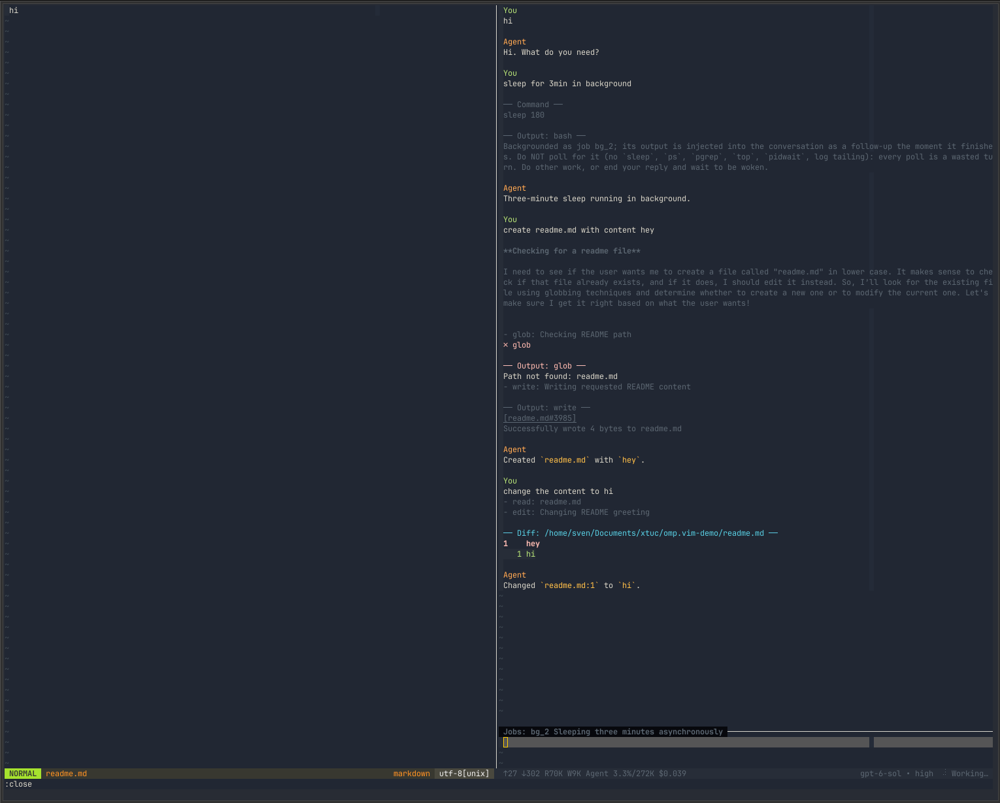

# omp.vim

Advanced oh-my-pi integration for Neovim.

<p align="center">
  
</p>

Put in your `~/.vimrc`:

```vim
Plug 'xtuc/omp.vim'
" ...
nnoremap <silent> <leader>o :lua require('omp').open()<CR>
```

## Key bindings

### Prompt

| Mode | Keys | Action |
| --- | --- | --- |
| Normal | `<Enter>` | Send prompt. From insert mode, press `<Esc>` first. |
| Insert | `<Enter>` | Insert newline. |
| Normal | `<C-c>` | Abort response. |
| Normal or insert | `<C-r>` | Search prompt history with CtrlP. `<Enter>` loads selection without sending; `<Esc>` closes picker and keeps draft. |
| Normal or insert | `<Up>` / `<Down>` | Browse history at first/last prompt line. `<Down>` past newest restores draft. |
| Normal | `k` / `j` | Browse history at first/last prompt line. |

### Transcript

| Keys | Action |
| --- | --- |
| `i` | Edit prompt. |
| `:q` | Close pane. |

### Dialogs

| Dialog | Keys | Action |
| --- | --- | --- |
| Choices and approvals | `j` / `k` or arrows, then `<Enter>` | Select option. |
| Choices and approvals | `q` or `<Esc>` | Dismiss. |
| Input | `<Enter>` | Submit text. |
| Input | `<Esc>` | Cancel. |
| Multiline editor | `<Enter>` in normal mode | Submit text. |
| Multiline editor | `q` in normal mode | Cancel. |

## Features

- Transcript auto-follows new output while prompt pane is selected; scroll independently when transcript pane is selected. Multiline prompts and errors, Markdown and tool output, approvals and todos.
- Statusline: model, thinking, context, cost, activity; divider above prompt: running tasks, active commands, and named background bash/eval jobs.
- RPC edit diffs use `difft` when available; unified-diff fallback.
- Per-project sessions resume on reopen; large histories use paged RPC when available. Prompt history: 100 prompts from current RPC session, not terminal's global history.
- Prompt stays editable during tool calls, including `wait`. Send a message to steer; OMP interrupts an interruptible wait, backgrounds the still-running command, and handles the message. Background jobs leave the divider when their result arrives. Changed clean file buffers reload after tools.

## Special commands

- `/new` — new session in current project.
- `/high` — set thinking level to high.
- Other oh-my-pi text-mode slash commands pass through RPC.

## Requirements

- Neovim, Bun, and oh-my-pi (`omp`). The RPC launcher expects `~/.bun/bin/bun` and `~/.bun/bin/omp` even if Neovim's `PATH` differs.
- `difft` is optional; without it, edit results use unified diffs.
